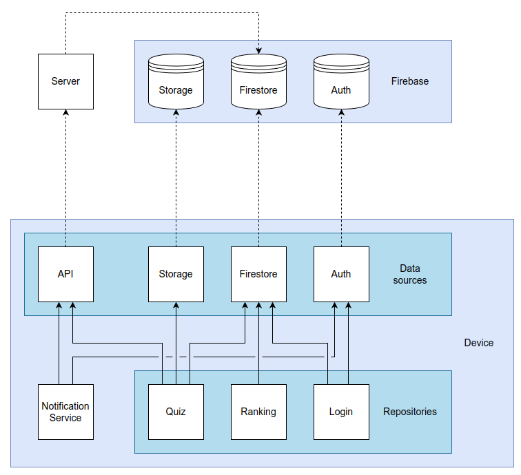
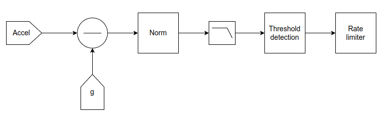
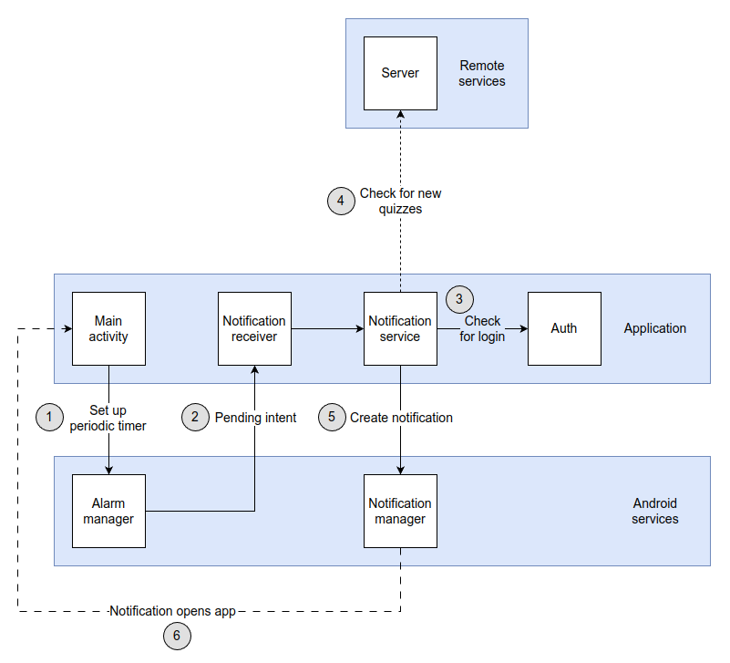

# QuizX

## Architecture

### Data layer



### Accelerometer filtering



### Notifications



## Database structure

```json
"users": {
    "u0": {
        "uuid": "u0",
        "displayName": "User Name",
        "score": 42,
        "pendingChallenges": ["q0", "q1"],
        "hasNew": true
    },
    "u1": {
        ...
    }
}

"quizzes": {
    "q0": {
        "uuid": "q0",
        "authorId": "u1",
        "imageUri": "...",
        "correctAnswer": "answer",
        "sentToUsers": false,
        "correctSubmissions": 3,
        "wrongSubmissions": 2
    }
}
```

## Setup

This application uses Firebase as an authentication and database system, so a project should be created and the corresponding `google-services.json` file should be put in `app/app`
